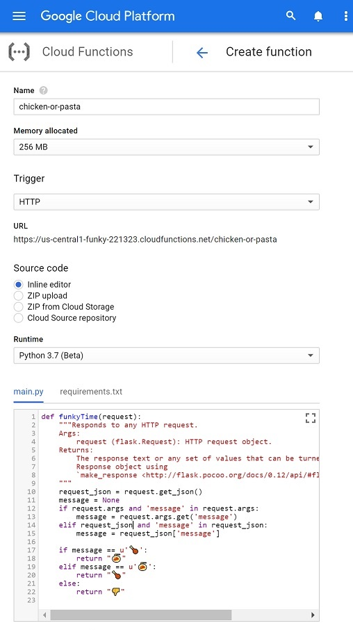
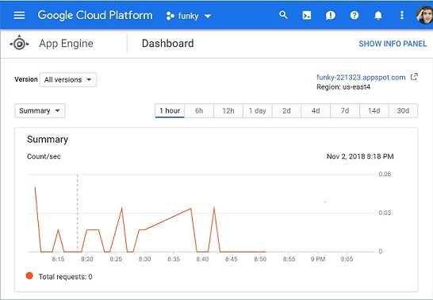

<h1 align="center"><a href="https://github.com/insanj/funky">🎷 funky</a></h1>
<h4 align="center">simple call &amp; response python to google cloud function</h4>

---

<h2 align="center">Table of Contents</h2>
1. [⛅ Cloud Function](#-cloud-function)
2. [🔥 try it out!](#-try-it-out)
3. [🚙 usage](#-usage)
4. [🚂 App Engine](#-app-engine)
5. [🥡 setup](#-setup)
6. [🎨 authors](#-authors)
7. [🔐 license](#-license)

<br/>


# ⛅ Cloud Function
## 🔥 try it out!

---

- go to [https://us-central1-funky-221323.cloudfunctions.net/chicken-or-pasta](https://us-central1-funky-221323.cloudfunctions.net/chicken-or-pasta) to get a response via web browser

## 🚙 usage

---

- [edit or create a new cloud function](https://console.cloud.google.com/functions) using Python 3.7 using this template:
```python
# -*- coding: utf8 -*-
def funkyTime(request):
	"""Responds to any HTTP request.
	Args:
	request (flask.Request): HTTP request object.
	Returns:
	The response text or any set of values that can be turned into a
	Response object using
	`make_response <http://flask.pocoo.org/docs/0.12/api/#flask.Flask.make_response>`.
	"""
	request_json = request.get_json()
	message = None
	if request.args and 'message' in request.args:
		message = request.args.get('message')
	elif request_json and 'message' in request_json:
		message = request_json['message']

	if message == u'🍗':
		return "🍝"
	elif message == u'🍝':
		return "🍗"
	else:
		return "👎"
```

- your google cloud platform console should look like this once completed:



# 🚂 App Engine
## 🔥 try it out!

test the live deployment of the gcloud socketio app 🖇

1. run `python funky.py <PARAM>` [to get a simple flask response via python](https://github.com/insanj/funky/archive/master.zip)

2. go to [https://funky.host/](https://funky.host/) to establish a socketio connection response via web browser

> try connecting with more than one web browser to send messages to each other! 
> try putting in a custom param to see a custom result based on the endpoint tree (such as [🍗](https://funky.host/🍗))!

---

## 🚙 usage

- modify `main.py` to change flask endpoints or add socket features

```python
from flask import Flask
app = Flask(__name__)

@app.route('/<thing>')
def mirrorThing(thing):
	return thing
```

- locally run `gunicorn -k eventlet -w 1 --bind 0.0.0.0:$(PORT) wsgi` to test the flask/socket server

- run `gcloud app deploy` to sync your changes with the google app engine you've set up

```
$ gcloud app deploy
Services to deploy:

descriptor:      [/funky/app.yaml]
source:          [/funky]
target project:  [funky-221323]
target service:  [default]
target version:  [20181102t210815]
target url:      [https://funky-221323.appspot.com]


Do you want to continue (Y/n)?  Y

Beginning deployment of service [default]...
╔════════════════════════════════════════════════════════════╗
╠═ Uploading 15 files to Google Cloud Storage               ═╣
╚════════════════════════════════════════════════════════════╝
File upload done.
Updating service [default]...done.
Setting traffic split for service [default]...done.
Deployed service [default] to [https://funky-221323.appspot.com]

You can stream logs from the command line by running:
  $ gcloud app logs tail -s default

To view your application in the web browser run:
  $ gcloud app browse
```

- check [app engine dashboard](https://console.cloud.google.com/appengine) to see how the project is faring



# 🥡 setup

---

1. (mostly optional) setup local [Google Cloud Platform Python Development Environment](https://cloud.google.com/python/setup)
- `sudo apt install python python-dev python3 python3-dev`
- `wget https://bootstrap.pypa.io/get-pip.py`
- `sudo python get-pip.py`
- `pip install --upgrade virtualenv`
- `virtualenv --python python3 env`
-  `pip install google-cloud-storage`

2. create new app engine using a [Python App Engine Standard Environment](https://cloud.google.com/appengine/docs/standard/python/quickstart)
- new app engine
- python standard environment

3. download the [Google Cloud SDK](https://cloud.google.com/sdk/?hl=en_US) and setup the `gcloud` command
- `wget https://dl.google.com/dl/cloudsdk/channels/rapid/downloads/google-cloud-sdk-223.0.0-linux-x86_64.tar.gz`
- `tar zxvf google-cloud-sdk-223.0.0-linux-x86_64.tar.gz ~/google-cloud-sdk`
- `cd ~ && ./google-cloud-sdk/install.sh`

4. initialize using `gcloud init`
- requires logging into google account and setting up `PATH`

5. deploy using `gcloud app deploy`

6. enable websocket use by running the following command:

`gcloud compute firewall-rules create default-allow-websockets --allow tcp:65080 --target-tags websocket --description "allow websocket traffic on port 65080"
`

> using websockets requires a configured billing account linked to your app engine project. using the basic flask endpoints, however, does not.

> add more dependancies by editing the `requirements.txt` file or following [the custom library instructions](https://cloud.google.com/appengine/docs/standard/python/tools/using-libraries-python-27)


# 🎨 authors

---

julian weiss (insanj), (c) 2018. reach out on [github](https://github.com/insanj)!

# 🔐 license

---

funky is licensed under gpl-3.0. [see license file](https://github.com/insanj/funky/blob/master/LICENSE).
